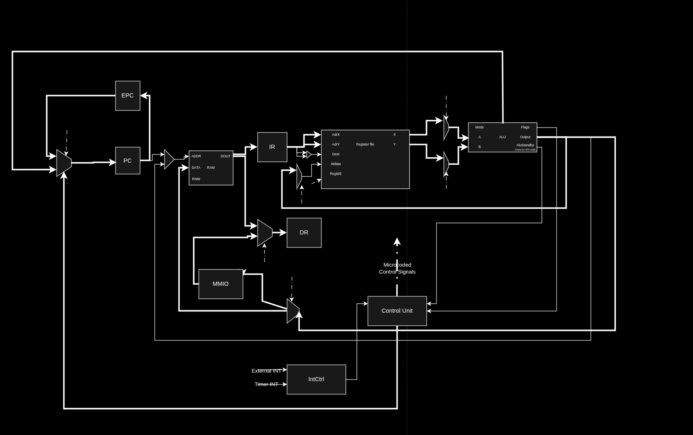

# Alpha-16: Ground-Up Custom ISA Processor & Toolchain

Custom 16-bit RISC processor fitted with simple hardware interrupt system, Memory mapped GPIO registers implemented in VHDL.
The processor's basic features are verified in cocotb simulation and the Processor and GPIO is deployed and demonstrated on Basys 3 board.

> [!NOTE]
> **Note on Origin:** This is an independent, extracurricular project developed from first principles prior to taking university Computer Architecture coursework.

## Technical details

1. Microprogrammed multi-cycle integer core
  - Register-register ALU operations
  - Load-store memory interfacing
  - Hardware Divider
  - Conditional and unconditional jumps
2. Memory mapped devices
  - Potential for 32 GPIOs
3. Interrupt system
  - Interrupt PC holder, enables 1 layered interrupts
  - Interrupt system can be enabled and disabled in code
  - Implementation for both external (e.g. emergency button) interrupt and timer interrupt
4. Segmented memory
    - Two 2-bit segment registers DS and CS to mitigate the limits of 16-bit addresses achieving an 18 bit address space
    - Currently, only ROMs may be used as CS
  
For detailed information about the ISA see the ```docs``` folder containing [ISA.md](docs/ISA.md) and [microarch.md](docs/microarch.md).


    
## RTL testing

> **Note:** These test are not meant to perform a full verification, rather they act as a "smoke test" or sanity check for the processor being in a fundamentally functioning state

The core has some simple assembly tests compiled.
The cocotb testbench script takes each test binary loads it into the program ROM and checks whether the debug value ```0x600D``` ends up in R1.
Its functionality of course can be extended.
The current test programs include:
- 0 - Basic test of the CPU being operational
- 1 - 3 - Load, store, add (with register addressing)
- 4 - Sub
- 5 - Data segment register
- 6 - Division and jumps

[](https://github.com/PeterG-12/alpha-processor/actions/workflows/github_cocotb_tests.yml)

Make sure to have the following dependencies:
- make
- ghdl
- python3 (with venv)

On linux:

```bash
cd sim
python3 -m venv .venv
source .venv/bin/activate
pip install -r requirements.txt
cd tb_processor
make
```


## Building

To build the Vivado project use the command
```bash
vivado -mode batch -source build_project.tcl 
```

Then open the project .xpr file in the directory alpha_processor created by Vivado
  
## GPIO pins demo

| State / Color | Binary Value (`XX_RedBlueWhite_RedBlueWhite`) | Hexadecimal Value |
| :--- | :--- | :--- |
| **Empty** | `10_000_000` | `0x80` |
| **Red** | `10_100_100` | `0xA4` |
| **Blue** | `10_010_010` | `0x92` |
| **White** | `10_001_001` | `0x89` |
| **White and Blue** | `10_011_011` | `0x9B` |


## Synthesis and Implementation information
| Resource | Utilization |
| --- | --- |
| **Slice LUTs** | 1352 |
| **LUT as Memory** | 8 |
| **LUT as Logic** | 1344 |
| **Slice Registers** | 919 |
| **Slices** | 560 |
| **F7 Muxes** | 128 |
| **Block RAM (BRAM) Tile** | 32 |

The design meets timing constraints for 100MHz
- Setup WNS: 0.015 ns (Met)
- Hold WHS: 0.078 ns (Met)
- Pulse Width WPWS: 4.0 ns (Met)


## Assembling programs

The Python assembler produces hex instructions in both Logisim and VHDL rom format.
It has no external dependencies it can be simply used as follows:

```bash
python assembler.py <assembly_textfile> <starting_address>
```

## Logisim implementation

The Logisim-evolution implementation can be found in the ```logisim``` directory and can  be very helpful for educational, cycle-by-cycle execution tracing of a program's execution

NOTE: Over time the VHDL implementation's features superseded the Logisim version. 


