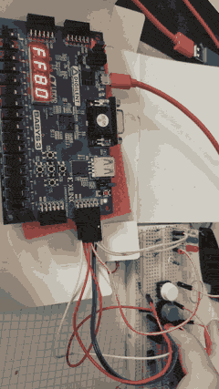
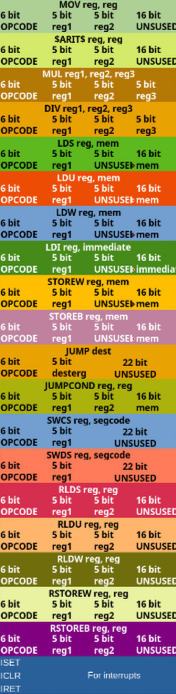
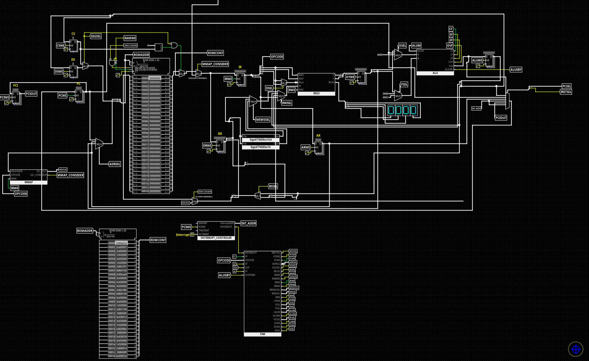

# VHDL implementation of custom ISA processor

Custom 16-bit RISC processor inspired by RISC-V, MIPS and 8086 ideas with simple hardware interrupt system and GPIO registers implemented in VHDL, deployed and demonstrated on Basys 3 board.

## Technical details

1. Micro-programmed multi-cycle integer core
  - Register-register ALU operations
  - Load-store memory interfacing
  - Hardware Divider
  - Conditional and unconditional jumps
2. Memory mapped devices
  - Potential for 32 GPIOs
3. Interrupt system
  - Interrupt PC holder, enables 1 layered interrupts
  - Interrupt system can be enabled and disabled in code
  - Implementation for both external (e.g. emergency button) interrupt and timer interrupt

## Building

To build the Vivado project use the command
```bash
vivado -mode batch -source build_project.tcl 
```

Then open the project .xpr file in the directory alpha_processor created by Vivado
  
## GPIO pins demo

| State / Color | Binary Value (`XX_RBW_RBW`) | Hexadecimal Value |
| :--- | :--- | :--- |
| **Nothing** | `10_000_000` | `0x80` |
| **Red** | `10_100_100` | `0xA4` |
| **Blue** | `10_010_010` | `0x92` |
| **White** | `10_001_001` | `0x89` |
| **White and Blue** | `10_011_011` | `0x9B` |





## Assembling programs


The python asembler assembles instructions to both Logisim and VHDL rom format.
It has no external dependencies it can be simply used as follows:

```bash
python assembler.py <assembly_textfile> <starting_address>
```

## Logisim implementation

The logisim-evolution implementation can be found in the logisim directory and can  be very helpful for educational, cycle-by-cycle execution tracing of a programs execution

NOTE: The logisim implementation is not in full correspondance with the rtl



